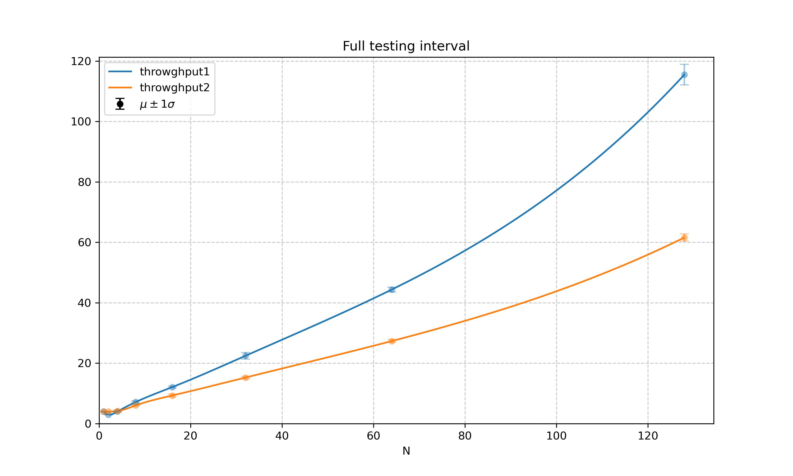
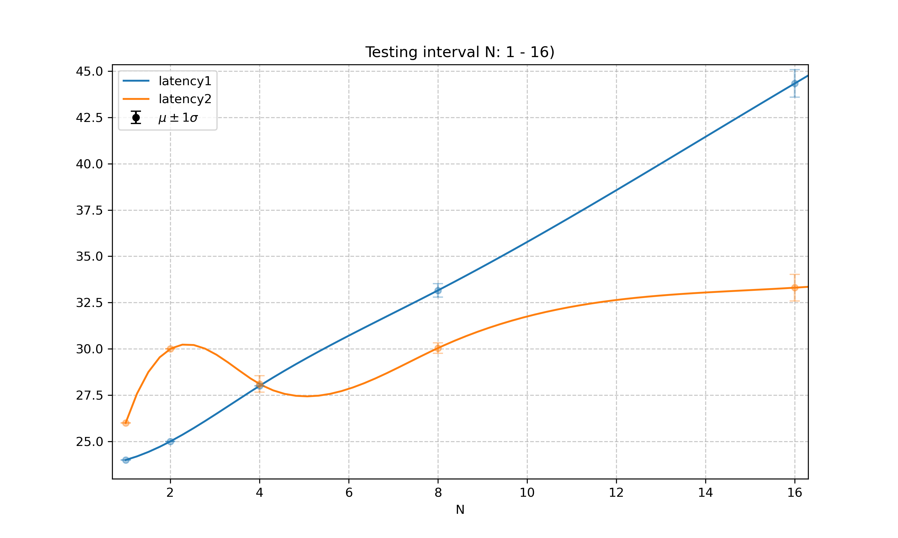
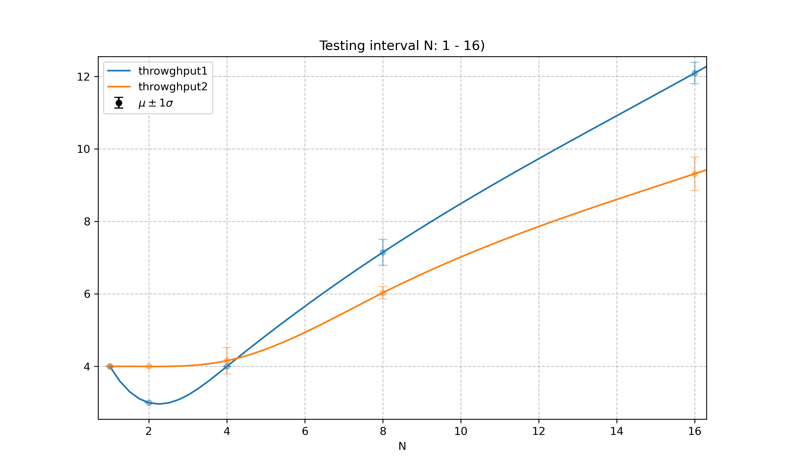

# Модуль бенчмаркинга

Этот модуль реализует интерфейс для расчёта latency и throughput функций, а также инструменты для настройки окружения и графического представления результатов.  

<table>
  <tr>
    <td width="44%" align="center">
      
      <br>
    </td>
    <td width="44%" align="center">
      
      <br>
    </td>
  </tr>
</table>
<table>
  <tr>
    <td width="44%" align="center">
      
      <em>Latency test</em>
      <br>
    </td>
    <td width="44%" align="center">
      
      <em>Throwhgput test</em>
      <br>
    </td>
  </tr>
</table>

## Использование
Полный пример использования находится в папке [usage](usage).


Рекомендуется производить тестирование  в режиме сборки `Release`, а также подготовть компьютер:  
* установть режим производительности `performance` - предлагается использовать скрипт [set_performance](env_setup/set_performance.sh) для установки режима и [restore_cpu_state](env_setup/restore_cpu_state.sh) для сброса.
* запускать программу с жесткой привязкой к одному ядру, выдав максимальный приоритет. *[запускать через [run_max_priority](env_setup/run_max_priority.sh)]*

Единичный замер производится функциями `TestLatency` и `TestThroughput`, имеющими следующий интерфейс:

```cpp
struct ResultT
{
    double average;
    double standard_deviation;
};

template <typename Func>
ResultT TestLatency(Func&& testing_func,    const size_t buckets_num    = 100,
                                            const size_t buckets_size   = 100,
                                            const size_t test_size      = 10,
                                            const double emissions_part = 0.05);

template <typename Func>
ResultT TestThroughput(Func&& testing_func, const size_t buckets_num    = 100,
                                            const size_t buckets_size   = 100,
                                            const size_t test_size      = 10,
                                            const double emissions_part = 0.05);
```

Параметры по умолчанию настраивают механизм теста, о котором будет сказано позже. 

Если тестирование производится с целью определения асимптотики функции, то результаты тестов можно скложить в массив и направить в фукнцию

```cpp
void ExportResultsToCSV(std::string curve_name, const std::vector<std::pair<double, ResultT>>& data, const std::string& filename);
```

которая создает `.csv` файл. Скрипт [stat_plot/spline.py](stat_plot/spline.py) считывает переданные ему `.csv` файлы и строит график, аппроксимирующий точки кубическим многочленом (примеры графиков приведены в начале ридми). 


## Принцип тестирования
* Для минимизации погрешности тестирования тесты разбиваются на `buckets_num` бакетов.  
* Каждый бакет содержит `buckets_size` тестов.  
* Каждый тест запускает переданную аргументом функцию `test_size` раз.

Для каждого бакета выбирается тест, прошедший за минимальное время. Фактически, при правильно настроенном запуске тестов истинное значение времени работы функции (будь то latency или throwghput) из-за накладных расходов точно будет меньше или равно тому, что мы измерим. Из всех минимумов по бакетам выкидывается `emissions_part` выбросов с максимальным результатом. Для итогового массива минимумов рассчитывается среднее и дисперсия.