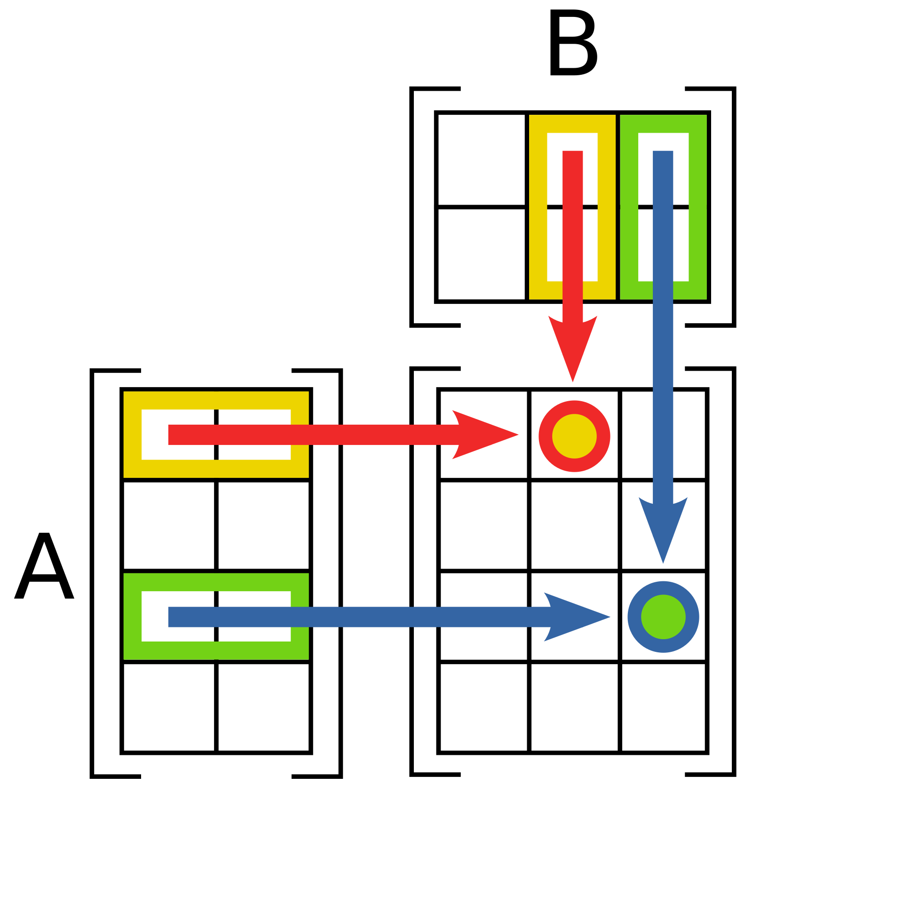
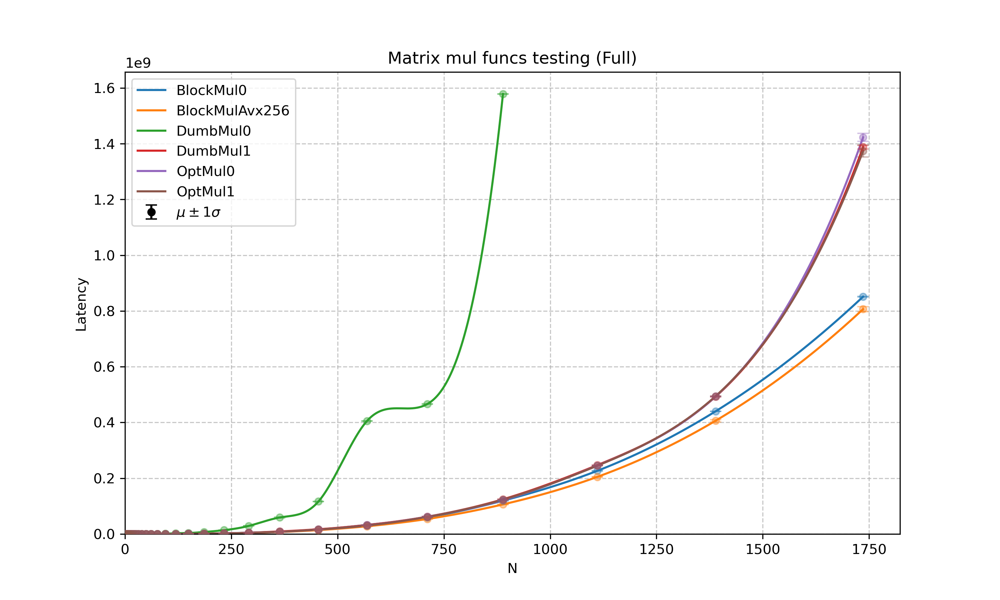
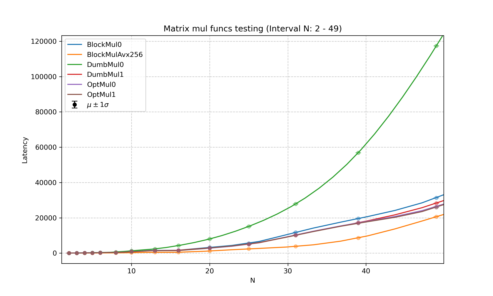
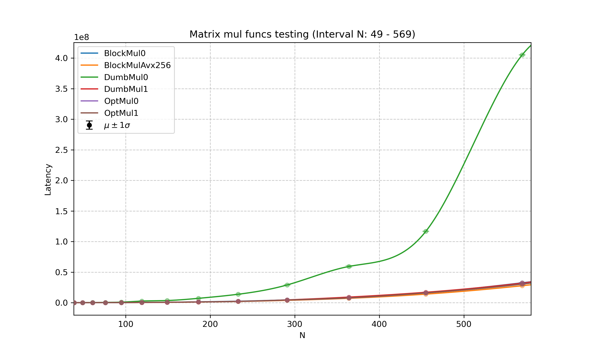
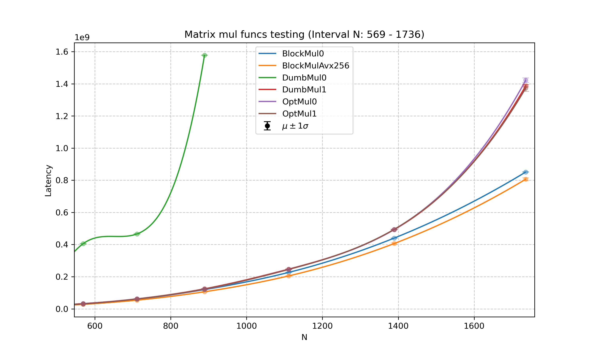

# Ускорение алгоритма расчёта произведения матриц

Реализация функций представлена в [*[src/matrix.cpp]*](src/matrix.cpp).  
Анализы тестирования расположены ниже.




Для матриц $A$ и $B$ размерностей $m \times n$ и $n \times p$ элемент матрицы $C = AB$ вычисляется по формуле 
$c\\_{ij} = \sum\\_{k=1}^{n} a\\_{ik}b\\_{kj}$.


### Первая итерация - наивная

Алгоритм в функции DumbMul0 реализует формулу «строка на столбец» напрямую.

<details>
  <summary>DumbMul0</summary>

```cpp  
static float LineMulCol(const Matrix& matrix1, const Matrix& matrix2, const size_t line, const size_t col)
{
    RLSU_ASSERT(matrix1.rows() >= line && matrix2.cols() >= col);
    RLSU_ASSERT(matrix1.cols() == matrix2.rows(), "matrix1.cols() = {}, matrix2.rows() = {}", matrix1.cols(), matrix2.rows());

    float matrix_dest = 0;

    for (size_t i = 0; i < matrix1.cols(); i++)
    {
        matrix_dest += matrix1[line, i] * matrix2[i, col];
    }

    return matrix_dest;
}

void Matrix::DumbMul0_(const Matrix& matrix1, const Matrix& matrix2, Matrix& matrix_dest)
{
    AssertMatixMulConsistency_(matrix1, matrix2, matrix_dest);
    
    for (size_t row = 0; row < matrix_dest.rows(); row++)
    {
        for (size_t col = 0; col < matrix_dest.cols(); col++)
        {
            matrix_dest[row, col] = LineMulCol(matrix1, matrix2, row, col);
        }
    }
}
```

</details>

Данная реализация обладает крайне низкой пространственной локальностью. При вычислении $\texttt{matrix2[i, col]}$ индекс $\texttt{i}$ (строка) меняется во внутреннем цикле, а $\texttt{col}$ (столбец) остается неизменным. В случае, когда матрица не помещается в кэш-линию размером 64 байта - то есть когда размер матрицы более 16 элементов типа $\texttt{float}$ - прохождение по строкам матрицы в внутреннем цикле функции приводит к постоянным промахам кеша, что многократно увеличивает время работы программы.


### Вторая итерация - Оптимизация порядка циклов

Перестановка циклов в функции DumbMul1 позволяет накопить результат вычисления каждого элемента матрицы $C$, работая с данными линейно.

<details>
  <summary>DumbMul1</summary>

```cpp  
void Matrix::DumbMul1_(const Matrix& matrix1, const Matrix& matrix2, Matrix& matrix_dest)
{
    AssertMatixMulConsistency_(matrix1, matrix2, matrix_dest);

    for (size_t row = 0; row < matrix1.rows(); row++)
    {
        for (size_t i = 0; i < matrix1.cols(); i++)
        {
            float matrix1_val = matrix1[row, i];
            
            for (size_t col = 0; col < matrix2.cols(); col++)
            {
                matrix_dest[row, col] += matrix1_val * matrix2[i, col];
            }
        }
    }
}
```

</details>

В этой реализации во внутреннем цикле обе марицы - `matrix2[i, col]` `matrix2[i, col]` и `matrix_dest[row, col]` - обходятся последовательно. Также `matrix1_val = matrix1[row, i]` загружается единственный раз для всей строки `matrix_dest`.


### Третья оптимизация - выравнивание строк матриц в памяти по 64 байта
Сделав строки матрицы выровненными в памяти по 64 байта, мы добьёмся того, что компилятор на высоком уровне оптимизации с большей вероятностью векторизует функцию, и чтение в векторный регистр будет происходить с чтением меньшего количества кэш-линий.

`OptMul1_` отличается выносом константных значений за рамки циклов. С флагом оптимизиции `-O3` это не даст прироста производительности.

<details>
  <summary>OptMul0_</summary>

```cpp  

void Matrix::OptMul0_(const Matrix& matrix1, const Matrix& matrix2, Matrix& matrix_dest)
{

    const float* const m1_data   = matrix1    .data_.data();
    const float* const m2_data   = matrix2    .data_.data();
          float* const dest_data = matrix_dest.data_.data();

    RLSU_ASSERT((reinterpret_cast<std::uintptr_t>(m1_data )  % 64) == 0 && "matrix1 is NOT 64-byte aligned!");
    RLSU_ASSERT((reinterpret_cast<std::uintptr_t>(m2_data )  % 64) == 0 && "matrix2 is NOT 64-byte aligned!");
    RLSU_ASSERT((reinterpret_cast<std::uintptr_t>(dest_data) % 64) == 0 && "matrix_dest is NOT 64-byte aligned!");

    AssertMatixMulConsistency_(matrix1, matrix2, matrix_dest);

    RLSU_ASSERT(m1_data != dest_data && m2_data != dest_data, "dest matrix is one of the source!");

    const float* __restrict__ m1_carr   = static_cast<const float*>(__builtin_assume_aligned(m1_data,   64));
    const float* __restrict__ m2_carr   = static_cast<const float*>(__builtin_assume_aligned(m2_data,   64));
          float* __restrict__ dest_carr = static_cast<      float*>(__builtin_assume_aligned(dest_data, 64));

    for (size_t row = 0; row < matrix1.rows(); row++)
    {
        for (size_t i = 0; i < matrix1.cols(); i++)
        {
            float matrix1_val = m1_carr[row * matrix1.stride() + i];
    
            for (size_t col = 0; col < matrix2.cols(); col++)
            {
                dest_carr[row * matrix_dest.stride() + col] += matrix1_val * m2_carr[i * matrix2.stride() + col];
            }
        }

    }

}

```

</details>


### Четвёртая итерация - блочное умножение
Разбиение матриц на блоки позволяет удерживать данные в кэшe L1/L2 на протяжении всего цикла вычислений, минимизируя обращения к основной памяти. 
Алгоритм работает не матрицами целиком, перемножает окна размером 64 на 64 $\texttt{float}$ - так три окна будут единовременно помещаться в L1/L2 кэш. . На низких уровнях оптимизации (например, -O2) 6 вложенных циклов создают значительную нагрузку на управляющую логику процессора (инкременты счетчиков, проверки границ), что может нивелировать выигрыш от работы с кэшем. На уровне -O3 компилятор способен самостоятельно векторизовать внутренние циклы, что делает эту версию конкурентоспособной.


Проблемной частью метода является обработка "хвостов" матриц, не влезших в окна. Расчёты с ними приходится производить отдельно после основного алгоритма.

<details>
  <summary>BlockMul0</summary>

```cpp  

void Matrix::BlockMul0_(const Matrix& matrix1, const Matrix& matrix2, Matrix& matrix_dest)
{
    const float* const m1_data   = matrix1.data_.data();
    const float* const m2_data   = matrix2.data_.data();
          float* const dest_data = matrix_dest.data_.data();

    RLSU_ASSERT(m1_data != dest_data && m2_data != dest_data, "dest matrix is one of the source!");
    RLSU_ASSERT((reinterpret_cast<std::uintptr_t>(m1_data  ) % 64) == 0 &&     "matrix1 is NOT 64-byte aligned!");
    RLSU_ASSERT((reinterpret_cast<std::uintptr_t>(m2_data  ) % 64) == 0 &&     "matrix2 is NOT 64-byte aligned!");
    RLSU_ASSERT((reinterpret_cast<std::uintptr_t>(dest_data) % 64) == 0 && "matrix_dest is NOT 64-byte aligned!");
    AssertMatixMulConsistency_(matrix1, matrix2, matrix_dest);

    const float* const __restrict__ m1_carr   = static_cast<const float*>(__builtin_assume_aligned(m1_data,   64));
    const float* const __restrict__ m2_carr   = static_cast<const float*>(__builtin_assume_aligned(m2_data,   64));
          float* const __restrict__ dest_carr = static_cast<      float*>(__builtin_assume_aligned(dest_data, 64));

    const size_t m1_rows   = matrix1    .rows();
    const size_t m1_cols   = matrix1    .cols();
    const size_t m2_cols   = matrix2    .cols();
    const size_t dest_cols = matrix_dest.cols();

    const size_t block_size = 64;

    //---------------------------- blocks - dumb mul for remains ---------------------------------------------

    const size_t m1_rows_clean = (m1_rows / block_size) * block_size;
    const size_t m1_cols_clean = (m1_cols / block_size) * block_size;
    const size_t m2_cols_clean = (m2_cols / block_size) * block_size;

    for (size_t row_blk = 0; row_blk < m1_rows_clean; row_blk += block_size)
    {
        for (size_t i_blk = 0; i_blk < m1_cols_clean; i_blk += block_size)
        {
            for (size_t col_blk = 0; col_blk < m2_cols_clean; col_blk += block_size)
            {
                for (size_t row = row_blk; row < row_blk + block_size; ++row)
                {
                    const size_t dest_row_offset = row * dest_cols;
                    const size_t m1_row_offset   = row * m1_cols;

                    for (size_t i = i_blk; i < i_blk + block_size; ++i)
                    {
                        const float matrix1_val = m1_carr[m1_row_offset + i];
                        const size_t m2_row_offset = i * m2_cols;

                        for (size_t col = col_blk; col < col_blk + block_size; ++col)
                        {
                            dest_carr[dest_row_offset + col] += matrix1_val * m2_carr[m2_row_offset + col];
                        }
                    }
                }
            }
        }   
    }

    if (m1_rows_clean == m1_rows && m1_cols_clean == m1_cols && m2_cols_clean == m2_cols)
    {
        return;
    }


    //------------------------- cleanup ------------------------------------------------
    for (size_t row_blk = 0; row_blk < m1_rows; row_blk += block_size)
    {
        for (size_t i_blk = 0; i_blk < m1_cols; i_blk += block_size)
        {
            for (size_t col_blk = 0; col_blk < m2_cols; col_blk += block_size)
            {
                if (row_blk < m1_rows_clean && 
                    i_blk   < m1_cols_clean && 
                    col_blk < m2_cols_clean)
                {
                    continue; 
                }

                const size_t row_end = std::min(row_blk + block_size, m1_rows);
                const size_t i_end   = std::min(i_blk   + block_size, m1_cols);
                const size_t col_end = std::min(col_blk + block_size, m2_cols);

                for (size_t row = row_blk; row < row_end; row++)
                {
                    const size_t dest_row_offset = row * dest_cols;
                    const size_t m1_row_offset   = row * m1_cols;

                    for (size_t i = i_blk; i < i_end; i++)
                    {
                        const float matrix1_val = m1_carr[m1_row_offset + i];
                        const size_t m2_row_offset = i * m2_cols;

                        for (size_t col = col_blk; col < col_end; col++)
                        {
                            dest_carr[dest_row_offset + col] += matrix1_val * m2_carr[m2_row_offset + col];
                        }
                    }
                }
            }
        }
    }
}

```

</details>


### Пятая и финальная итерация - векторизация AVX2 и FMA

Эта версия реализует векторизацию алгоритма перемножения матриц на интринсиках. Также здесь используется интринсик `_mm256_fmadd_ps`, который векторно выполняет операцию $a \times b + c$ за один такт. В отличие от последовательного выполнения умножения и сложения, FMA выполняет всего одно округление в конце, что повышает точность.

В версии также присутствует проблема обработки хвостов окон. Здесь это решается через запись в векторные регистры и из них через масочные `_mm256_maskload_ps` и `_mm256_maskstore_ps`. Отсутствие ветвлений  и дополнительных циклов позволяет сохранять высокую скорость обработки даже на неудобных размерах матриц.

<details>
  <summary>внутренний цикл BlockMulAvx256_</summary>

```cpp  

if (remain >= 8) 
{
    __m256 v_dest = _mm256_loadu_ps(&dest_carr[dest_row_offset + col]);

    for (size_t i = i_blk; i < i_end; ++i)
    {
        __m256 v_m1 = _mm256_set1_ps(m1_carr[m1_row_offset + i]);
        __m256 v_m2 = _mm256_loadu_ps(&m2_carr[i * m2_cols + col]);

        v_dest = _mm256_fmadd_ps(v_m1, v_m2, v_dest);
    }

    _mm256_storeu_ps(&dest_carr[dest_row_offset + col], v_dest);
}

else 
{
    // v_count = [remain, remain, ... , remain]
    __m256i v_count = _mm256_set1_epi32(remain);


    // remain = 3 -> mask = [0, 0, 0, 0, 0, 1, 1, 1]
    // и записывать будем только 3 числа
    __m256i mask = _mm256_cmpgt_epi32(v_count, v_indices);

    // читаем матрицу dest по маске
    // maskload_ps автоматически пишет нули в неактивные слоты
    __m256 v_dest = _mm256_maskload_ps(&dest_carr[dest_row_offset + col], mask);

    for (size_t i = i_blk; i < i_end; ++i)
    {
        __m256 v_m1 = _mm256_set1_ps(m1_carr[m1_row_offset + i]);
        // чтение m2 по маске
        __m256 v_m2 = _mm256_maskload_ps(&m2_carr[i * m2_cols + col], mask);
        
        v_dest = _mm256_fmadd_ps(v_m1, v_m2, v_dest);
    }

    _mm256_maskstore_ps(&dest_carr[dest_row_offset + col], mask, v_dest);
}
```

</details>

## Валидация
Валидность расчёта матриц тестируется в [tests/correctness/e2e](tests/correctness/e2e). 

* Генератор рандомных матриц единожды создаёт магазин [*[tests/assets]*](tests/assets) всевозможных матриц размеров от $[2 \times 2]$ до заданного максимального размера. Размеры матриц идут с шагом $k=1.25$ в том смысле, что следующие после $[m \times n]$ матрицы будут иметь размер $[\lceil m \cdot k \rceil \times n]$ и $[m \times \lceil n \cdot k \rceil]$.

* Все тесты будут использовать этот готовый набор матриц.

* Генератор e2e тестов перемножает набор пар матриц из магазина и генерирует ключ теста, используя наивную и наверняка верную (почти, как будет описано позже) функцию `DumbMul1`. 

* Через тесты прогоняются все реализованные функции расчёта произведения матриц.

* Тесты интегрированы в CI и запускаются при каждом пуше в репозиторий.

Как было сказано ранее, функция `BlockMulAvx256` имеет более высокую точность, чем другие, тк `_mm256_fmadd_ps` выполняет всего одно округление в конце вместо двух. Из-за этого приходится повышать планку погрешности в тестах на корректность.


## Бенчмарк

Точная оценка latency функии перемножения матриц реализуется модулем бенчмаркинга 
[dumb_math::benchmarking](../benchmarking). Подробнее о деталях измерения можно прочитать в [benchmarking/readme.md](../benchmarking/readme.md).

### Характеристики тестирущей машины 

| Параметр | Значение |
| :--- | :--- |
| **Аппаратное обеспечение (Hardware)** | |
| Процессор (CPU) | Intel(R) Core(TM) Ultra 5 125H |
| Архитектура | x86_64 |
| Ядра / Потоки | 14 ядер / 18 потоков (4P + 8E + 2LP-E) |
| Базовая / Максимальная частота | 400 МГц / 4500 МГц |
| L1 Кэш (данные / инструкции) | 448 КиБ / 768 КиБ |
| L2 Кэш | 14 МиБ |
| L3 Кэш | 18 МиБ (общий) |
| RAM    | 22 ГиБ (доступно ОС) |
| **Программное обеспечение (Software)** | |
| Операционная система | Ubuntu 22.04.5 LTS |
| Ядро Linux | 6.8.0-107-generic |
| Компилятор | GCC 13.1.0 |

На моей машине есть поддержка следующих расширений:
SSE, SSE2, SSE3, SSSE3, SSE4.1, SSE4.2, AES, AVX, AVX2, FMA, AVX_VNNI, SHA.  
Также имеется 2 исполнительных FMA блока.

Так как валидность подтверждается тестами [tests/correctness/e2e](tests/correctness/e2e), для удобного бенчмаркинга используются квадратные матрицы $[N \times N]$.

Результаты тестирования с разным масштабом:

<table>
  <tr>
    <td width="44%" align="center">
      
      <br>
    </td>
    <td width="44%" align="center">
      
      <br>
    </td>
  </tr>
</table>

<table>
  <tr>
    <td width="44%" align="center">
      
      <br>
    </td>
    <td width="44%" align="center">
      
      <br>
    </td>
  </tr>
</table>

### Описание особенностей

#### 1. Выраженный горб у наивного алгоритма  
Причину возникновения горба могу только предположить. Назовём размер расширенных нулями до кратности 64 строк матрицы `stride`. В наивном алгоритме DumbMul0 доступ к матрице $B$ идет по столбцам: $\texttt{B[i, col]} \to \texttt{B[i+1, col]} \to \dots$  
Расстояние между этими элементами в памяти равно `stride` и кратно 64 байтам. Возможно, при неудачных значениях $N$, когда stride кратен размеру кэш-сета, каждый шаг по строке матрицы $B$ заставляет процессор обращаться к одному и тому же сету кэша.Если количество строк, участвующих в вычислении, превышает количество путей ассоциативности, каждая новая загрузка строки выселяет предыдущую.

#### 2. Асимптотика
* Заметно, что время работы наивного алгоритма отличается в десятки раз от оптимизированных версий. 
* На малых размерах матриц оптимизированные версии имеют почти одинаковое время работы. Компилятор сам векторизует `OptMul0_` и `BlockMul0_`.
* С ростом $N$ функции, рассчитывающие произведение по блокам (`BlockMul0_` и `BlockMulAvx256_`), заметно превосходят остальные. Асимптотически они примерно одинаковы, однако версия с интринсиками чуть быстрее. Возможно это из-за того, что в `BlockMul0_` необходимо более долго обрабатывать "хвосты".

#### 3. Итог
Полученные погрешности свидетельствуют о достоверности полученных результатов тестов. Особенности графиков поддаются логическому объяснению и соответствуют предсказываемому поведению.